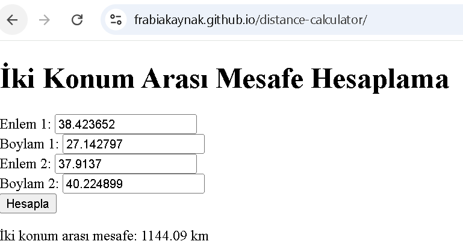

# 🌍 Mesafe Hesaplayıcı

Bu basit web uygulaması, girilen iki farklı konumun (enlem ve boylam) birbirine olan uzaklığını kilometre cinsinden hesaplar. Hesaplama için Haversine formülü kullanılmıştır.

## 🚀 Özellikler
- İki konum arası mesafeyi hesaplar
- Kullanıcıdan enlem ve boylam bilgisi alır
- Sonucu kilometre cinsinden gösterir
- Temel HTML, CSS ve JavaScript kullanılmıştır

## 🛠️ Kullanılan Teknolojiler
- HTML
- CSS
- JavaScript (Haversine Formülü)

## 📷 Ekran Görüntüsü
Burada Türkiye'nin iki şehrinin ( İzmir ve Diyarbakır) enlem ve boylamları girilerek aradaki mesafe hesapalnmıştır.

## 🌐 Canlı Demo

[https://frabiakaynak.github.io/distance-calculator/](https://frabiakaynak.github.io/distance-calculator/)

---

## 📌 Not
Bu proje öğrenme amaçlı geliştirilmiştir ve geliştirilmeye açıktır.

./distance-calculator.png
